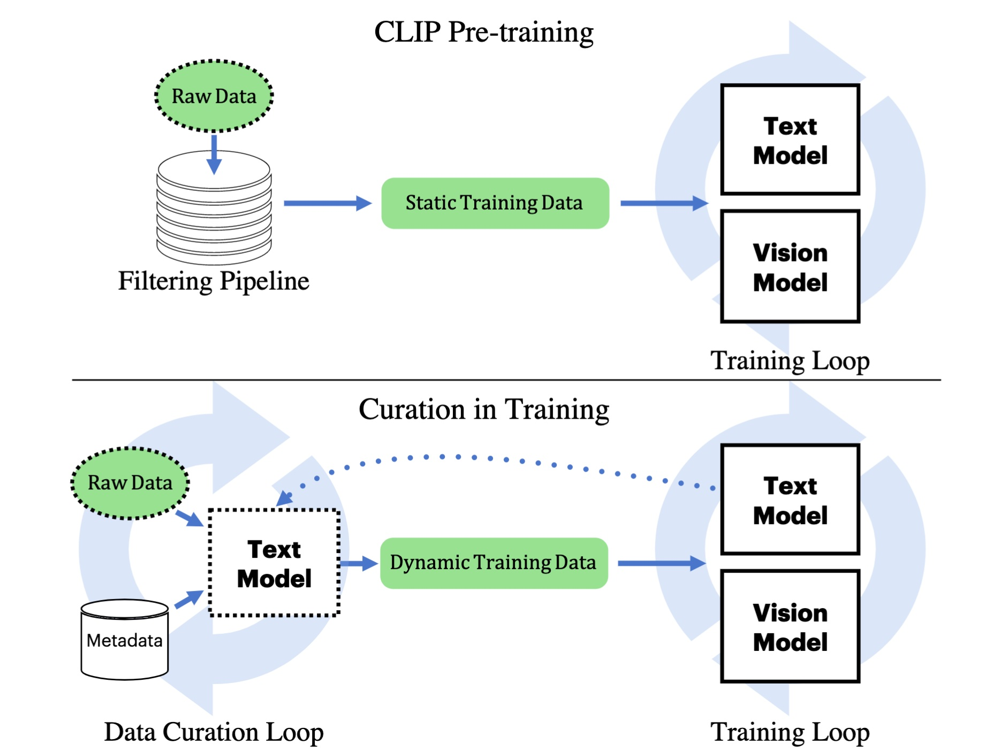

## CiT: Curation in Training

This repository contains the code for paper [CiT: Curation in Training for Effective Vision-Language Data](https://arxiv.org/abs/2301.02241). For the first time, CiT curates/optimizes training data during (pre-)training a CLIP-style model, archieves better scaling law and beats human's offline data filtering (for potential downstream tasks).

```bibtex 
@inproceedings{xu2023cit,
   title={CiT: Curation in Training for Effective Vision-Language Data},
   author={Hu Xu, Saining Xie, Po-Yao Huang, Licheng Yu, Russell Howes, Gargi Ghosh, Luke Zettlemoyer and Christoph Feichtenhofer},
   journal={arXiv preprint arXiv:2301.02241},
   year={2023}
}
```

## Updates
* 01/05/2023: initial release.


## Quick Links

  - [Overview](#overview)
  - [Getting Started](#getting-started)
    - [Prepare Vision Encoders](#prepare-vision-encoders)
    - [Download Pretrained CiT](#download-pretrained-cit)
    - [Use CiT with PyTorch](#use-cit-with-pytorch)
    - [Use CiT with Huggingface](#use-cit-with-huggingface)
  - [Model List](#model-list)
  - [Evaluation](#evaluation)
  - [Train CiT](#train-cit)
    - [Training](#training)
  - [Bugs or Questions?](#bugs-or-questions)
  - [Citation](#citation)
  - [Reference](#reference)

## Overview

This paper trades generality for efficiency and presents Curation in Training (CiT), a simple and efficient vision-text learning algorithm that couples a data objective into training. CiT automatically yields quality data to speed-up contrastive image-text training and alleviates the need for an offline data filtering pipeline, allowing broad data sources (including raw image-text pairs from the web). CiT contains two loops: an outer loop curating the training data and an inner loop consuming the curated training data. The text encoder connects the two loops. Given metadata for tasks of interest, e.g., class names, and a large pool of image-text pairs, CiT alternatively selects relevant training data from the pool by measuring the similarity of their text embeddings and embeddings of the metadata.



## Getting Started

This code is developed with minimal requirements in mind (tested under Python 3.9.7, PyTorch 1.10.2 and Transformers 4.19.2). All models are built under [Transformers](https://github.com/huggingface/transformers)'s [VisionTextDualEncoder](https://huggingface.co/docs/transformers/model_doc/vision-text-dual-encoder) to allow potential extension to other pre-trained models.

```bash 
pip install transformers==4.19.2
```

### Prepare Vision Encoders
CiT paper uses pre-trained vision encoders such as [MoCo-v3](https://github.com/facebookresearch/moco-v3), AugReg (Timm `>=0.4.12`, older version doesn't contain AugReg checkpoints) and [SWAG](https://github.com/facebookresearch/SWAG). They are not available in [Huggingface Transformers](https://github.com/huggingface/transformers) at the moment. 

First, clone or install 3rd party repos:
```bash 
git clone https://github.com/facebookresearch/moco-v3.git  # moco-v3
cd hfmodels && git clone -b v0.5.4 https://github.com/rwightman/pytorch-image-models.git  # AugReg from timm as a local copy.
cd ..
```
Note it is recommended to have different copies of timm with local imports since MoCo-v3 and AugReg models may ask for different versions (and timm is NOT backward/forward compatible). SWAG is from torch hub so we don't need to do anything.

**Training only**  
To download checkpoints of pre-trained vision encoders:
```bash 
cd pretrained_models && wget https://dl.fbaipublicfiles.com/moco-v3/vit-b-300ep/vit-b-300ep.pth.tar  # moco-v3
cd ..
```
Checkpoints for AugReg (timm) or SWAG (torch hub) should be automatically downloaded.

Lastly, launch the follow commands to convert these 3rd party models into huggingface models for training.

```bash 
python -m hfmodels.moco
python -m hfmodels.augreg
python -m hfmodels.swag
```
You should find them in `pretrained_models`.

### Download Pretrained CiT 
```bash 
wget https://dl.fbaipublicfiles.com/MMPT/cit/yfcc15m_in1k_mocob16.tar
tar xvf yfcc15m_in1k_mocob16.tar  # expected in pretrained_models/yfcc15m_in1k_mocob16
```
Check [Model List](#model-list) for other models.

### Use CiT with PyTorch
For transparency on pytorch, you can use the following code to load CiT pre-trained models (similar to resuming a training in `main.py`):

```python 
import torch
import run_configs

from torch.nn import functional as F
from models_citclip import build_model

config_name = "yfcc15m_in1k_mocob16"
args = getattr(run_configs, config_name)()
model, tokenizer = build_model(args)

state_dict = torch.load(f"pretrained_models/{config_name}/pytorch_model.bin", map_location='cpu')
model.load_state_dict(state_dict)
model.eval()

inputs = tokenizer(["a photo of dog"], padding="max_length", truncation=True, max_length=args.max_bert_length, return_tensors="pt")
inputs["pixel_values"] = torch.randn(1, 3, 224, 224)
with torch.no_grad():
    outputs = model(**inputs)
    image_embeds = F.normalize(outputs["image_embeds"], dim=-1, p=2)
    text_embeds = F.normalize(outputs["text_embeds"], dim=-1, p=2)
    cosine = image_embeds @ text_embeds.t()
print(cosine.item())
```

### Use CiT with Huggingface
Please run the following to dump pre-trained encoders into Transformer compatible interface (we converted all pre-trained checkpoints into huggingface format). Hosting checkpoints in huggingface coming soon.

```python 
import torch

import hfmodels
import run_configs

from torch.nn import functional as F
from transformers import AutoModel, AutoTokenizer


config_name = "yfcc15m_in1k_mocob16"
args = getattr(run_configs, config_name)()

model = AutoModel.from_pretrained(f"pretrained_models/{config_name}")
tokenizer = AutoTokenizer.from_pretrained(args.text_pretrained)  # TODO: we didn't save tokenizer, so read the original.

inputs = tokenizer(["a photo of dog"], padding="max_length", truncation=True, max_length=args.max_bert_length, return_tensors="pt")
inputs["pixel_values"] = torch.randn(1, 3, 224, 224)

with torch.no_grad():
    outputs = model(**inputs)
    image_embeds = F.normalize(outputs.image_embeds, dim=-1, p=2)
    text_embeds = F.normalize(outputs.text_embeds, dim=-1, p=2)
    cosine = image_embeds @ text_embeds.t()

print(cosine.item())
print(outputs.logits_per_image.item())  # this is multiplied by logit_scale by HF.
```


## Model List
Our released models are listed as following. You can import these models by the following Get Started/Evaluation section. 
|              Model              | Table in Paper |
|:-------------------------------|:--------:|
|  [cit/yfcc15m_in1k_mocob16](https://dl.fbaipublicfiles.com/MMPT/cit/yfcc15m_in1k_mocob16.tar) | Table 4 |
| [cit/yfcc100m_in1k_mocob16](https://dl.fbaipublicfiles.com/MMPT/cit/yfcc100m_in1k_mocob16.tar) | Table 4 |

More models coming soon.

## Evaluation
Evaluate on IN-1K:

```bash 
python main.py yfcc15m_in1k_mocob16 --resume pretrained_models/yfcc15m_in1k_mocob16 --eval 
```

Evaluate on 26 tasks:
```bash 
python main.py eval_yfcc15m_in1k_mocob16 --resume pretrained_models/yfcc15m_in1k_mocob16 --eval 
# or via submitit:
python submitit_citclip.py eval_yfcc15m_in1k_mocob16
```

### Training

**Data**  
Preprocess YFCC15M can be done as follows:
```bash 
mkdir -p data/yfcc15m
# follow https://github.com/facebookresearch/SLIP to download and compile a list of downloaded images to data/yfcc15m/flickr_unique_ids.npy
# copy YFCC15M (https://github.com/openai/CLIP/blob/main/data/yfcc100m.md) to `data/yfcc15m/yfcc100m_subset_data.tsv`
python scripts/make_yfcc15m_dataset.py
```

Preprocessing YFCC100M (too big to fit all in CPU memory):
```bash 
mkdir -p data/yfcc100m
python scripts/make_yfcc100m_dataset.py
```

**Training scripts**  

Every config is written as a native python function/class to record the args and neither bash args or mixed programming languages nor python config (eg, versioning OmegaConf or yaml).
Check example configs in `run_configs.py`, e.g., 

```bash 
python main.py curate100_5k_bsz16k  # a local training of the default setup in the paper on YFCC15M on a single GPU.
torchrun --nproc_per_node=8 main.py curate100_5k_bsz16k  # on a local node with 8 GPUs.
python submitit_citclip.py curate100_5k_bsz16k  # submit the SLURM job with 16 GPUs (nodes=2 and ngpus=8). `conda install -c conda-forge submitit` or `pip install submitit`
```

**Single GPU Training**  
coming soon

## Curated Dataset
As a side benefit, CiT outputs a dataset. 

**YFCC100M4ImageNet**  
coming soon

## Bugs or questions?

If you have any questions related to the code or the paper, feel free to email Hu Xu (`huxu@meta.com`).

## TODO

- [] demo of usage
- [] model weights
- [] integrated downloading with huggingface and pytorch hub

## Citation

Please cite our paper if CiT contributes in your work:

```bibtex 
@inproceedings{xu2023cit,
   title={CiT: Curation in Training for Effective Vision-Language Data},
   author={Hu Xu, Saining Xie, Po-Yao Huang, Licheng Yu, Russell Howes, Gargi Ghosh, Luke Zettlemoyer and Christoph Feichtenhofer},
   journal={arXiv preprint arXiv:2301.02241},
   year={2023}
}
```

## Reference

The codebase is developed from [MAE](https://github.com/facebookresearch/mae), [SLIP](https://github.com/facebookresearch/SLIP) repos and [Huggingface Transformers](https://github.com/huggingface/transformers).


## License

The majority of CiT is licensed under CC-BY-NC, however portions of the project are available under separate license terms: https://github.com/facebookresearch/slip is licensed under the MIT license and https://huggingface.co/docs/transformers/index is licensed under the Apache 2.0 license.
